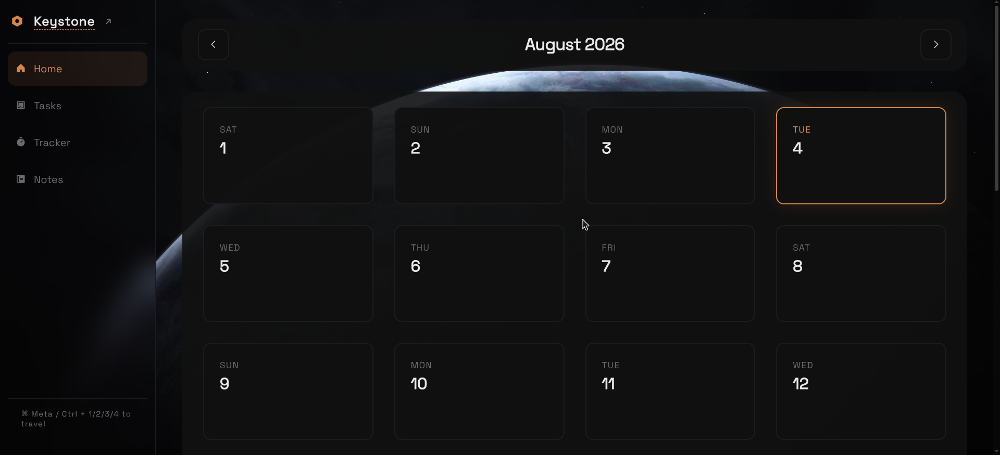

# keystone

Keystone is my attempt at a private, local-first workspace website.

It tries to combine all of the features I love from different productivity
apps and websites, while also allowing easy backups and a seamless experience.

It was built with a focus on fast performance, crash-safe data handling, 
and keyboard-driven workflows, bringing together task management, time 
tracking, notes, and analytics into one unified website.

> [!NOTE]
> ABOUT AI USAGE:
>
> I used AI to help build the early versions of the tools in Keystone 
> since I needed them in a hurry, and because I built this for myself.
> That said, I went through and checked almost all the code myself, 
> and fixed all the annoying bugs (security or otherwise) I could find.
>
> Also, the demo.json was extended using Gemini

## Usage

### Live

1. Go to the website: [keystone-snowlock.web.app](https://keystone-snowlock.web.app/)
2. Try it out!

(if you want to see how it would look with some data, download and load the demo json: 
[assets/demo.json](https://github.com/snowlock-dev/keystone/blob/main/assets/demo.json))

### Local

1. Clone the repo.
2. Start a live server: I prefer python: `python -m http.server 8000`
3. Visit *http://localhost:8000* on your browser of choice!

All dependencies are included natively in the project!

## Core Features

### Dashboard

- *Daily Metrics:* I included active study streaks for both time and 
questions, along with your average session durations so you know how 
you're doing.

- *Visual Analytics:* There are interactive 7-day bar charts segmented 
by subject, plus a pie chart to see exactly where your focus is actually going. MADE USING CHART.JS

- *Goal Tracking:* You can set daily goals for hours studied and questions solved.

### Study Tracker & Timer

- *Active Timer:* It pauses and resumes easily, but I made sure it 
survives page reloads and syncs instantly across tabs.

- *Session Logging:* You can do both automatic and manual logging, or a 
mix of both depending on how you like to work.

- For the subjects, I currently have it set to: Physics, Chemistry, Maths, 
and Mock Tests (ie timed exam solving, stuff like that).

### Task Management (TaskFlow & Taskset)

Both of these tools were ported over from older standalone version that I had

- *TaskFlow:* This is a calendar-driven daily task list. I added 
filtering for all/active/completed tasks and progress bars so you can
 see what's left.

- *Taskset:* I needed a place to just dump unscheduled ideas and chores, 
so I built this global list.

- *Zen Mode:* Actually a part of TaskSet, it is just a simple, distraction-free
 fullscreen mode for when you need to focus.

### Quick Notes

- The built-in quick notes are simple, using a debounced auto-save so it doesn't freeze up.

- I also made sure it flushes any pending saves right on `beforeunload` so you never lose a thought.

### Tests & Error Logs

- *Test Dashboard:* You can log your mock test scores here. I added progress charts 
and a prediction for your average based on your last 3 tests.

- *Error Log:* I built this to strictly catalog mistakes by subject, chapter, and type 
(Conceptual/Silly/Calculation/Other). You can filter by the type of mistake and 
write out markdown takeaways.

Error Logs was one of the most important and essential features for this project, and I am happy how it turned out

### Global Search (Ctrl/Cmd + K)
 
- It's a fuzzy-search inspired by fuzzel and wofi, to really complete the workflow.

- It searches through all your daily tasks, global tasks, and error logs instantly.

- I added bangs like `!t` for tasks and `!e` for errors to narrow things down quickly.

## Keyboard Shortcuts
1. `Ctrl/Cmd + K`: Opens Global Search
2. `Ctrl/Cmd + 1–6`: Jumping between sections
3. `←/→`: Moving through months in calendar & days in taskflow
4. `/`: Focuses the task input in TaskFlow
5. `Esc`: Closes modals or kicks you out of Zen Mode

## Architecture
It's all vanilla JS and completely local-first using `localStorage`:

- *Crash-Safe Atomic Writes:* To make sure that no data gets lost by crashes and such, keystone 
writes to a `_tmp` key first, validates it, and only then swaps it in.

- *Transactional State:* A `Storage.transaction()` method that clones the state, modifies it, 
validates it, and atomically commits it. If the data is invalid, it just gets rejected.

- *Cross-Tab Sync:* It uses `storage` events to keep tabs in sync, and background tabs pause their 
note-saving to prevent overwrites.

- *Normalization & Migration:* It automatically cleans up malformed data, generates missing 
IDs, and migrates any of the older, legacy data.

- *Storage Limit Awareness:* It tracks the actual byte size using `TextEncoder` and warns you when 
you start getting close to that 5MB limit.

## Backup & Restore

- *Export:* A 1-click export to a `keystone-backup.json` file that grabs all your notes, tasks, sessions, tests, and errors.
- *Import:* When you bring it back in, it validates the entire JSON structure before it commits anything.

## Roadmap

- [x] Build placeholder `index.html`
- [x] Add notes section
- [x] Add a guideplan/taskflow section
- [x] Add a timelog section with charts & graphs
- [x] Add a daily goal section with streaks
- [x] Add a good todo section
- [x] Add a test dashboard
- [x] Add an error dashboard

### Stretch Goals

- [x] Replace custom SVG graphs with `chart.js`
- [x] Add markdown for Quick Notes Section

## Credits

* `assets/wallpaper.jpg`(Default Wallpaper) from: [Wallhaven](https://wallhaven.cc/w/nm6o2k)

* `assets/ph-fill` / `assets/ph-regular`: [Phosphor Icons](https://phosphoricons.com/)
